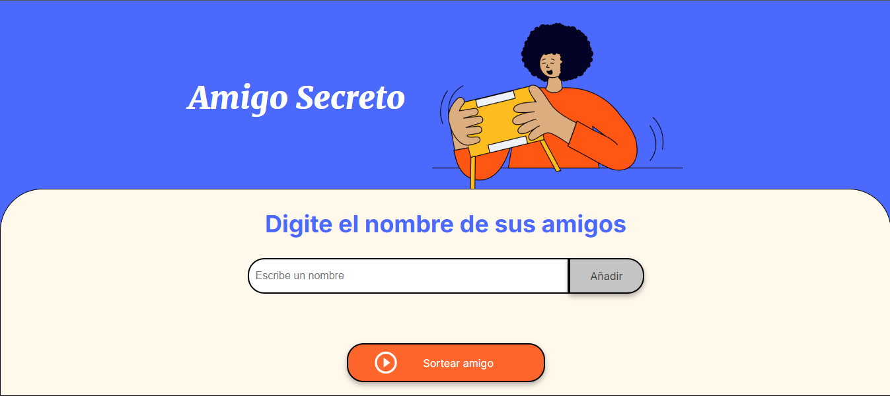
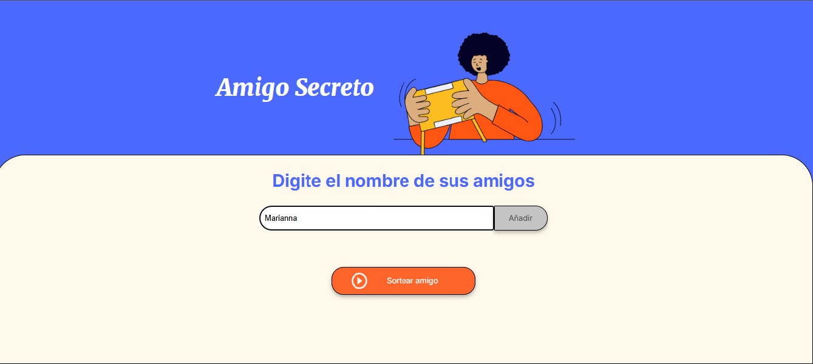
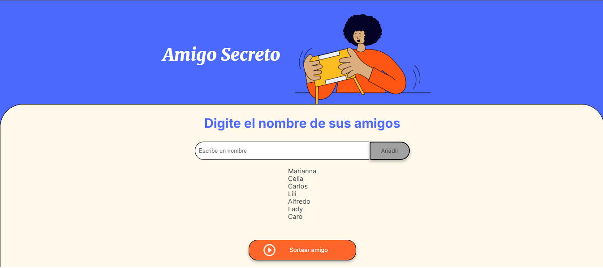
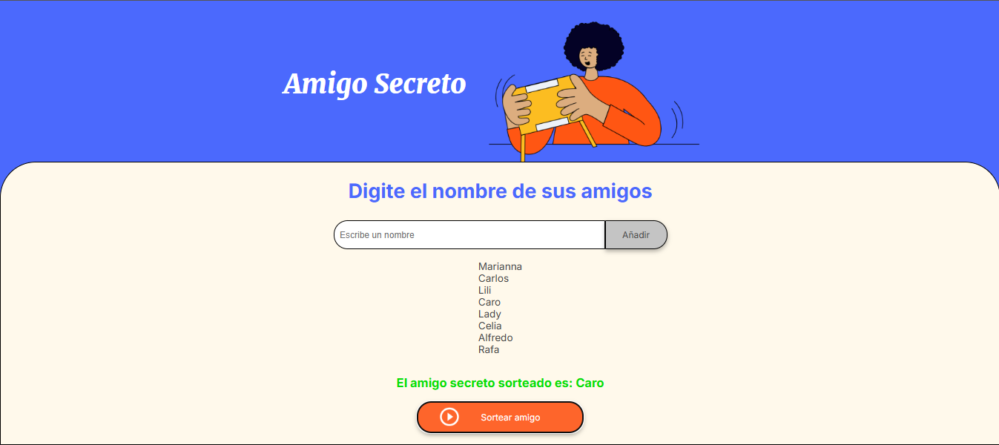

# Sorteo de Amigo Secreto

Este proyecto es una aplicación sencilla en JavaScript que permite agregar nombres de amigos a una lista y luego seleccionar aleatoriamente uno de ellos como "amigo secreto".

## 🚀 Características
- Agregar amigos a una lista.
- Mostrar la lista de amigos agregados.
- Seleccionar aleatoriamente un amigo de la lista.
- Limpiar automáticamente los valores después del sorteo.

## 📌 Requisitos
Para ejecutar este proyecto, solo necesitas un navegador web moderno con soporte para JavaScript.

## 📜 Instrucciones de Uso
1. **Ingresar un nombre** en el campo de texto.
2. **Presionar el botón "Agregar Amigo"** para incluirlo en la lista.
3. **Repetir el paso 1 y 2** hasta completar la lista de amigos.
4. **Presionar el botón "Sortear Amigo Secreto"** para elegir un nombre al azar.
5. El resultado se mostrará en pantalla y la lista se limpiará si vuelves a ingresar nombres, iniciarà un nuevo sorteo sin necesidad de refrescar el .

## 📌 Mejoras Futuras
- Evitar que un mismo nombre se agregue más de una vez.
- Obligar a que se ingrese un mínimo de tres nombres para que tenga sentido el sorteo.
- Mejorar la eficiencia del código. Se colocó un ciclo for para cumplir con lo solicitado en el challenge, lo que obliga a borrar la lista y volverla a crear
    cada vez que se agrega un amigo, pero no hace falta el ciclo. Con esto se reduce el código y es más eficiente.

    
## ¿Cómo funcina? 

### Esta es la pantalla que verás al abrir la aplicación
   

### Ingresa cada nombre y presiona el botón "Añadir"
   

### A medida que vas agregando los nombres, estos van apareciendo en la lista
   

### Cuando hayas añadido todos los nombre, presiona el botón "Sortear amigo y aparecerá el nombre del amigo sorteado aleatoriamente
